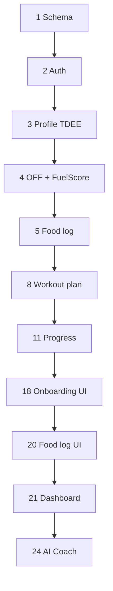

# FuelIQ — Project Setup, File Structure & Build Order

Chunk 8 reference for bootstrapping the repo, installing dependencies, and the
order Cursor (or any developer) should build features to avoid dependency issues.

---

## 8.1 Initialize the project

### Option A — Clone / use this repo (recommended)

The monorepo is already scaffolded. From the repo root:

```bash
# Requires Node 18+ and npm 9+ (workspaces)
cd fueliq

# Install all workspace dependencies (client + server)
npm install

# Optional: enable Claude AI, JWT, Postgres
cp .env.example .env
# Edit .env — at minimum set JWT_SECRET for auth

# Optional: Anthropic SDK (AI coach, plans, suggestions, weekly review)
npm install @anthropic-ai/sdk -w server

# Run API (:4000) + Vite client (:5173)
npm run dev
```

Open **http://localhost:5173**. New users go to `/onboarding`; returning users
redirect to `/dashboard`.

Other scripts:

```bash
npm run dev:server    # API only (tsx watch)
npm run dev:client    # Vite only
npm run build         # production build (server dist + client dist)
npm run typecheck     # TypeScript check both workspaces
npm start             # run compiled server (after build)
```

**macOS note:** `better-sqlite3` is a native module. If `npm install` fails,
install Xcode Command Line Tools: `xcode-select --install`.

SQLite is created automatically at `server/data/fueliq.db` on first API boot.

### Option B — Greenfield (spec 8.1 baseline)

If starting from scratch, these commands match the original spec direction, then
merge in this repo’s structure:

```bash
# Root monorepo
mkdir fueliq && cd fueliq
npm init -y
# Add workspaces in package.json: ["client", "server"]

# Frontend
npm create vite@latest client -- --template react-ts
cd client
npm install
npm install tailwindcss postcss autoprefixer
npm install recharts react-router-dom html5-qrcode
npx tailwindcss init -p
cd ..

# Backend
mkdir server && cd server
npm init -y
npm install express cors dotenv zod better-sqlite3 multer
npm install -D typescript tsx @types/express @types/node @types/cors @types/better-sqlite3 @types/multer
cd ..
npm install -D concurrently
```

**This repo differs from the spec template** (intentionally):

| Spec 8.1 | This repo |
|----------|-----------|
| `axios` | Native `fetch` in `client/src/lib/api.ts` |
| `zustand` + `store/` | React state + `localStorage` (auth token, coach chat, notifications) |
| `jsonwebtoken` + `bcryptjs` | `node:crypto` HS256 JWT + scrypt (no native bcrypt dep) |
| `pg` required | SQLite dev default; `server/sql/schema.postgres.sql` for production |
| `lucide-react` | Emoji / inline SVG icons |
| `ts-node` / `nodemon` | `tsx watch` for dev |

Optional production / AI packages:

```bash
npm install @anthropic-ai/sdk -w server   # Claude (optional)
npm install pg -w server                  # Postgres driver (when wiring DATABASE_URL)
```

---

## 8.2 File structure (actual)

```
fueliq/
├── .env.example                 # Copy to .env (root or server/)
├── .gitignore
├── package.json                 # npm workspaces, `npm run dev`
├── README.md                    # Feature docs (Chunks 1–7)
├── SETUP.md                     # This file (Chunk 8)
│
├── client/                      # React + Vite + TypeScript + Tailwind
│   ├── index.html               # Syne + DM Sans fonts
│   ├── vite.config.ts           # Dev proxy /api → :4000
│   ├── tailwind.config.js       # Dark-mode design tokens (Chunk 6)
│   ├── postcss.config.js
│   ├── tsconfig.json
│   ├── public/favicon.svg
│   └── src/
│       ├── main.tsx             # Router + AppNotifications
│       ├── index.css            # Global styles, .card, .btn-*
│       ├── pages/
│       │   ├── RootRedirect.tsx
│       │   ├── Onboarding.tsx       # spec: Onboarding.tsx
│       │   ├── DashboardPage.tsx    # spec: Dashboard.tsx
│       │   ├── LogPage.tsx          # spec: FoodLog.tsx
│       │   ├── WorkoutsPage.tsx     # spec: Workouts.tsx
│       │   ├── ActiveWorkoutPage.tsx
│       │   ├── WorkoutHistoryPage.tsx
│       │   ├── ProgressPage.tsx     # spec: Progress.tsx
│       │   ├── CoachPage.tsx        # spec: Coach.tsx
│       │   └── ProfilePage.tsx      # spec: Profile.tsx
│       ├── components/
│       │   ├── layout/          # Sidebar, BottomNav, TopBar, AppShell
│       │   ├── ui/              # CalorieRing, MacroBar, charts, MealSection…
│       │   ├── modals/          # FoodSearchModal, AddWaterModal, WorkoutPreferencesModal
│       │   ├── coach/           # ChatMarkdown
│       │   ├── BarcodeScanner.tsx
│       │   ├── FoodSearchModal.tsx
│       │   ├── NotificationSettings.tsx
│       │   ├── SupplementTracker.tsx
│       │   ├── MfpImportModal.tsx
│       │   └── …                # Logo, Spinner, CheckinCard, etc.
│       ├── hooks/
│       │   ├── useAnimatedNumber.ts
│       │   └── useSmartNotifications.ts
│       └── lib/
│           ├── api.ts           # fetch client + auth (not axios)
│           ├── types.ts         # Profile types
│           ├── foodTypes.ts
│           ├── workoutTypes.ts
│           ├── progressTypes.ts
│           ├── units.ts         # imperial ↔ metric
│           ├── options.ts
│           ├── draft.ts         # onboarding draft
│           ├── chatStorage.ts
│           └── notificationSettings.ts
│
└── server/                      # Express + TypeScript
    ├── package.json
    ├── tsconfig.json
    ├── sql/
    │   └── schema.postgres.sql  # canonical Postgres DDL (spec: db/schema.sql)
    ├── data/                    # fueliq.db (gitignored, created at runtime)
    ├── uploads/                 # progress photos (gitignored)
    └── src/
        ├── index.ts             # App entry, route mounts
        ├── auth/
        │   ├── jwt.ts           # spec: middleware/auth.ts (JWT)
        │   ├── password.ts      # scrypt hashing
        │   └── middleware.ts    # attachUser, requireAuth
        ├── domain/
        │   ├── types.ts
        │   ├── calculations.ts  # spec: services/tdee.ts
        │   ├── fuelscore.ts     # spec: services/fuelScore.ts
        │   ├── food.ts, workout.ts, dates.ts, analytics.ts
        │   └── *Schema.ts       # Zod validators
        ├── db/
        │   ├── index.ts         # SQLite schema bootstrap (spec: db/index.ts pool)
        │   ├── userRepo.ts
        │   ├── profileRepo.ts
        │   ├── logRepo.ts
        │   ├── waterRepo.ts
        │   ├── mealsRepo.ts
        │   ├── workoutRepo.ts
        │   ├── progressRepo.ts
        │   ├── customFoodRepo.ts
        │   └── supplementRepo.ts
        ├── services/
        │   ├── openFoodFacts.ts
        │   ├── fuelscore via domain/
        │   ├── suggestions.ts   # Claude food suggestions
        │   ├── workoutPlan.ts   # Claude workout plans
        │   ├── chat.ts          # spec: claude.ts (coach)
        │   ├── coachContext.ts
        │   ├── insights.ts
        │   ├── weeklyReview.ts
        │   ├── daySummary.ts
        │   ├── exerciseDemo.ts  # wger API
        │   └── mfpImport.ts
        └── routes/
            ├── auth.ts
            ├── profile.ts
            ├── foods.ts         # spec: food.ts (+ /api/food alias)
            ├── log.ts
            ├── water.ts
            ├── templates.ts
            ├── recipes.ts
            ├── suggestions.ts
            ├── workouts.ts
            ├── exercises.ts
            ├── dashboard.ts
            ├── progress.ts
            ├── checkin.ts
            ├── ai.ts
            ├── supplements.ts
            └── import.ts
```

There is no `client/src/App.tsx` — routing lives in `main.tsx` via
`createBrowserRouter`.

---

## 8.3 Build order for Cursor

Follow this sequence when implementing or extending FuelIQ. The repo already
contains all steps; use this order for **new features** or **rebuilds**.

### Phase 1 — Data & auth (backend foundation)

| Step | What | Key paths | Verify |
|------|------|-----------|--------|
| 1 | Database schema | `server/src/db/index.ts`, `server/sql/schema.postgres.sql` | `GET /api/health`, DB file created |
| 2 | Auth (register/login/JWT) | `server/src/auth/*`, `server/src/routes/auth.ts` | `POST /api/auth/register`, `GET /api/auth/me` |
| 3 | Profile + TDEE/macros | `server/src/domain/calculations.ts`, `routes/profile.ts` | `PUT /api/profile`, `GET /api/profile/targets` |

### Phase 2 — Nutrition (backend)

| Step | What | Key paths | Verify |
|------|------|-----------|--------|
| 4 | Open Food Facts + FuelScore | `services/openFoodFacts.ts`, `domain/fuelscore.ts`, `routes/foods.ts` | `GET /api/foods/search?q=chicken` |
| 5 | Food log CRUD + summary | `db/logRepo.ts`, `routes/log.ts`, `services/daySummary.ts` | `POST /api/log/entry`, `GET /api/log?date=` |
| 6 | Water, templates, recipes | `routes/water.ts`, `templates.ts`, `recipes.ts` | Water + template endpoints |
| 7 | AI food suggestions | `services/suggestions.ts`, `routes/ai.ts` | `GET /api/ai/suggestions` |

### Phase 3 — Workouts (backend)

| Step | What | Key paths | Verify |
|------|------|-----------|--------|
| 8 | Workout plan generator | `services/workoutPlan.ts`, `routes/workouts.ts` | `POST /api/workouts/generate-plan` |
| 9 | Workout logging + burn | `domain/workout.ts` (MET), `workoutRepo.ts` | `POST /api/workouts/logs` |
| 10 | Exercise demos (wger) | `services/exerciseDemo.ts`, `routes/exercises.ts` | `GET /api/exercises/demo?name=` |
| 11 | Progress + dashboard | `db/progressRepo.ts`, `routes/progress.ts`, `dashboard.ts` | `GET /api/dashboard`, `GET /api/progress/summary` |
| 12 | Weekly check-in + insights | `services/insights.ts`, `weeklyReview.ts`, `checkin.ts` | `GET /api/checkin`, `POST /api/checkin/generate` |

### Phase 4 — Advanced backend (Chunks 5–7)

| Step | What | Key paths | Verify |
|------|------|-----------|--------|
| 13 | Custom foods + route aliases | `customFoodRepo.ts`, `index.ts` mounts | Spec paths `/api/food/*`, `/api/weight` |
| 14 | AI coach + streaming | `coachContext.ts`, `chat.ts`, `routes/ai.ts` | `POST /api/ai/chat/stream` (SSE) |
| 15 | Supplements + MFP import | `supplementRepo.ts`, `mfpImport.ts` | `/api/supplements`, `POST /api/import/mfp` |

### Phase 5 — Frontend (in order)

| Step | What | Key paths | Verify |
|------|------|-----------|--------|
| 16 | API client + types | `client/src/lib/api.ts`, `types.ts` | Token in `localStorage`, requests hit proxy |
| 17 | Design system + shell | `tailwind.config.js`, `components/layout/*` | Dark theme, sidebar/bottom nav |
| 18 | Onboarding wizard | `pages/Onboarding.tsx` | Saves profile, redirects |
| 19 | Profile page | `pages/ProfilePage.tsx` | Edit + recalc targets + photos |
| 20 | Food log page | `pages/LogPage.tsx`, `FoodSearchModal.tsx`, `BarcodeScanner.tsx` | Search, scan, log, macros |
| 21 | Dashboard | `pages/DashboardPage.tsx`, `ui/*` | 3-column layout, rings, insights |
| 22 | Workouts + active mode | `WorkoutsPage.tsx`, `ActiveWorkoutPage.tsx`, `WorkoutHistoryPage.tsx` | Plan, start, finish, history |
| 23 | Progress charts | `pages/ProgressPage.tsx`, `ui/WeightChart.tsx`, `CalorieChart.tsx` | Recharts wired |
| 24 | AI Coach | `pages/CoachPage.tsx`, `coach/ChatMarkdown.tsx` | Stream + localStorage history |
| 25 | Notifications + extras | `useSmartNotifications.ts`, Profile panels | Browser notifications, supplements, MFP |

### Phase 6 — Polish

| Step | What |
|------|------|
| 26 | Empty states, error toasts, loading spinners on every page |
| 27 | Responsive pass (mobile bottom nav, desktop sidebar) |
| 28 | `prefers-reduced-motion`, debounced food search (300ms in `SearchTab`) |
| 29 | Optional: Redis OFF cache, react-query, lazy-loaded charts |



---

## 8.4 Key third-party APIs

| Service | Purpose | Auth | Used in |
|---------|---------|------|---------|
| **Open Food Facts** | Food search, barcode nutrition | None (set `OPEN_FOOD_FACTS_USER_AGENT`) | `server/src/services/openFoodFacts.ts` |
| **Anthropic Claude** | Suggestions, workout plans, insights, weekly review, coach chat (streaming) | `ANTHROPIC_API_KEY` | `suggestions.ts`, `workoutPlan.ts`, `chat.ts`, `insights.ts` |
| **wger** | Exercise demo images (free alternative to ExerciseDB) | None | `server/src/services/exerciseDemo.ts` |
| ExerciseDB (RapidAPI) | *Not integrated* — spec alternative to wger | RapidAPI key | Swap in `exerciseDemo.ts` if desired |

**Client env:** `VITE_API_BASE_URL` — used when not relying on Vite proxy (production).

**Server env:** see `.env.example` — `JWT_SECRET`, `PORT`, `DATABASE_URL`, `ANTHROPIC_API_KEY`.

---

## 8.5 Performance notes

| Recommendation | Status in repo |
|----------------|----------------|
| Cache Open Food Facts 24h (Redis / LRU) | Not implemented — add in `openFoodFacts.ts` if traffic grows |
| Debounce food search 300ms | Implemented in `FoodSearchModal` `SearchTab` |
| Paginate log history (50/page) | Not implemented — `listLogs` uses limits; add cursor pagination if needed |
| Memoize TDEE/macros in UI | Use `useMemo` on derived targets (Profile, Log summary) |
| Lazy-load Recharts | Charts load with route; optional `React.lazy` on `ProgressPage` |
| react-query / SWR | Not used — `fetch` + local state; good upgrade for dashboard refetch |

---

## What makes FuelIQ different

| Feature | Generic app | FuelIQ |
|---------|-------------|--------|
| Calorie tracking | ✓ | ✓ |
| Food quality score | ✗ | ✓ **FuelScore (1–10)** |
| Personalized macro targets | Basic | **Mifflin-St Jeor TDEE** + goal adjustments |
| Workout plans | Generic | **AI from your biometrics** (+ local fallback) |
| Calorie burn integration | Manual | **MET-based net calories** on log screen |
| Food suggestions | ✗ | **AI gap-filling** suggestions |
| Weekly AI review | ✗ | ✓ Sunday check-in |
| AI Coach | ✗ | ✓ **Streaming chat with profile/log/plan context** |
| Barcode scanner | Sometimes | ✓ **html5-qrcode** built-in |
| Supplement tracker | ✗ | ✓ Optional module |
| MFP CSV import | ✗ | ✓ Stretch import with retroactive FuelScore |

---

## Quick route map (after `npm run dev`)

| Page | URL |
|------|-----|
| Home redirect | `/` |
| Onboarding | `/onboarding` |
| Dashboard | `/dashboard` |
| Food log | `/log` |
| Workouts | `/workouts` |
| Active workout | `/workouts/active` |
| History | `/workouts/history` |
| Progress | `/progress` |
| AI Coach | `/coach` |
| Profile | `/profile` |

API base: **http://localhost:4000/api** (proxied as `/api` in dev).
